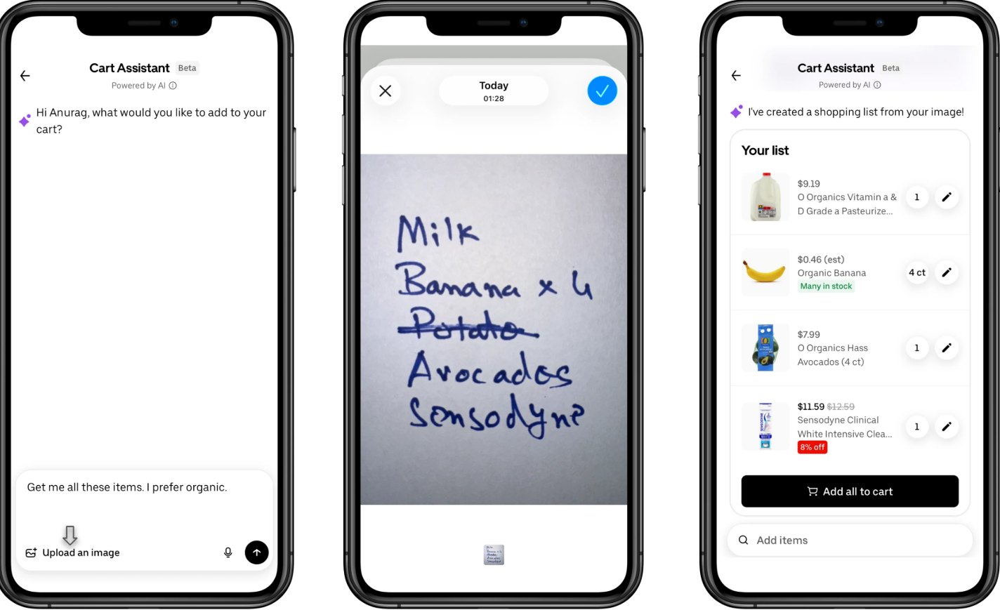
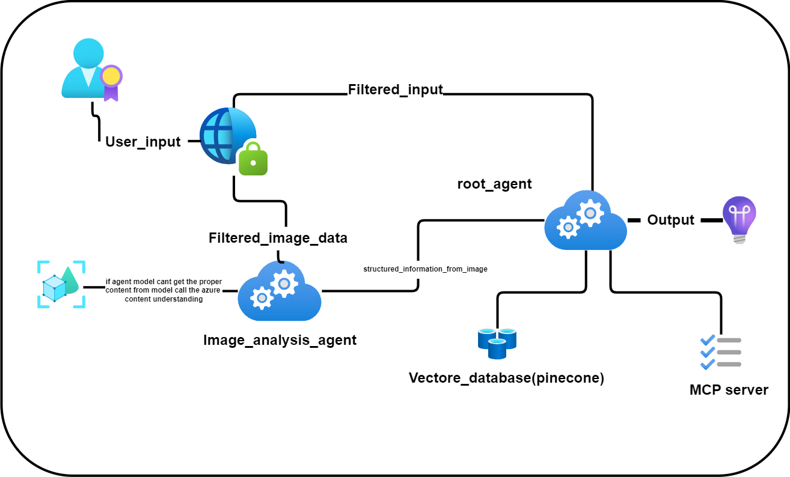
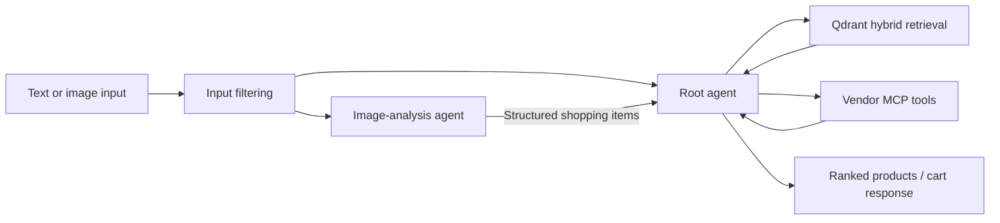
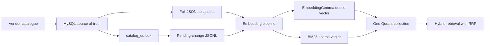

# Shopping Agent

Shopping Agent is an AI-assisted product discovery system for grocery and food-ordering experiences. A user can type a shopping request or upload a photograph of a handwritten list. The system converts the request into structured items, retrieves relevant vendor products, and prepares a result that can later be passed to vendor tools through MCP.

The repository currently contains the knowledge-base pipeline: a synthetic MySQL catalogue, full and incremental JSONL exports, and Qdrant indexing with dense and sparse vectors. The Microsoft Agent Framework orchestration, image-analysis agent, MCP server, and end-user application are planned components.

## Product experience

The intended interaction accepts an image, optional text preferences, crossed-out handwritten items, and quantities. It then returns editable product matches.



## Architecture



> The original architecture image labels the vector database as Pinecone. The current implementation uses **Qdrant** as the vector database.

The planned request flow is:



The implemented knowledge-base flow is:



## Knowledge-base design

MySQL remains the product source of truth. Qdrant is a derived search index and can be rebuilt from MySQL whenever necessary.

Each active product variant becomes one JSONL record and one Qdrant point. The point contains:

- A `dense` vector from `google/embeddinggemma-300m`.
- A `sparse` vector from `Qdrant/bm25`.
- Product, vendor, category, dietary, pricing, stock, SKU, barcode, and source-version metadata in the payload.
- A deterministic UUID generated from the stable JSONL `_id`.

Both vectors are stored as named vectors in the same Qdrant collection. A future retrieval layer can query both and combine the candidate lists with reciprocal rank fusion (RRF).

Chunking and section detection are intentionally not used. A product variant is already a short, atomic retrieval unit; splitting it would separate useful attributes such as brand, size, dietary flags, aliases, and availability. Chunking should only be introduced if the catalogue later contains long, multi-topic descriptions.

## Repository structure

```text
shoppingAgent/
|-- docs/
|   `-- images/
|       `-- handwritten-shopping-flow.png
|-- src/shoppingagent/
|   |-- main.py
|   `-- knowledge_base/
|       |-- seed_mysql.py
|       |-- export_products_jsonl.py
|       |-- index_products_qdrant.py
|       |-- track_transaction.py
|       `-- data/
|           |-- products.jsonl
|           `-- products_pending_changes.jsonl
|-- pyproject.toml
|-- shoppingagent.drawio
|-- shoppingagent.drawio.png
`-- README.md
```

## Prerequisites

- Python 3.12 or newer.
- [`uv`](https://docs.astral.sh/uv/) for dependency and environment management.
- MySQL 8 or a compatible MySQL server.
- A local Qdrant instance or Qdrant Cloud collection.
- Sufficient disk space for the Hugging Face embedding model cache.

## Installation

Install the locked project dependencies:

```powershell
uv sync
```

Configure credentials as environment variables. Do not commit credentials to the repository.

```powershell
$env:MYSQL_HOST = "127.0.0.1"
$env:MYSQL_PORT = "3306"
$env:MYSQL_USER = "root"
$env:MYSQL_PASSWORD = "<your-mysql-password>"
$env:MYSQL_DATABASE = "shopping_agent"

$env:QDRANT_URL = "http://localhost:6333"
$env:QDRANT_API_KEY = ""
$env:QDRANT_COLLECTION = "shopping-products-v1"
```

For Qdrant Cloud, replace `QDRANT_URL` with the cluster URL and set `QDRANT_API_KEY`. Keep the key empty for a local unsecured Qdrant instance.

## Build the knowledge base

### 1. Seed the MySQL catalogue

The seeder creates the schema and a reproducible demonstration catalogue. Its current configuration creates 5,000 products with two variants per product.

```powershell
uv run python -m shoppingagent.knowledge_base.seed_mysql
```

Important settings are defined near the top of `seed_mysql.py`:

- `PRODUCT_COUNT = 5000`
- `VARIANTS_PER_PRODUCT = 2`
- `BATCH_SIZE = 500`
- `RESET_TABLES = False`

Set `RESET_TABLES` to `True` only for an intentional destructive rebuild, and return it to `False` afterward. The generated data is for development and evaluation; production vendors should be ingested through vendor-specific adapters.

### 2. Export MySQL records to JSONL

```powershell
uv run python -m shoppingagent.knowledge_base.export_products_jsonl
```

The exporter writes files atomically and prints a SHA-256 digest:

- `products.jsonl` is a complete snapshot of active variants.
- `products_pending_changes.jsonl` contains the latest unprocessed `UPSERT` and `DELETE` outbox events.

The relevant switches in `export_products_jsonl.py` are:

```python
EXPORT_FULL_SNAPSHOT = True
EXPORT_PENDING_CHANGES = True
FETCH_BATCH_SIZE = 1000
```

### 3. Create dense and sparse vectors in Qdrant

For the initial load, `INPUT_JSONL` in `index_products_qdrant.py` should point to the full snapshot:

```python
INPUT_JSONL = DATA_DIR / "products.jsonl"
```

Run the indexer:

```powershell
uv run python -m shoppingagent.knowledge_base.index_products_qdrant
```

The first run creates `shopping-products-v1` with two named vectors. Later `UPSERT` records replace the existing point because the source `_id` always produces the same Qdrant UUID. A `DELETE` record removes that point, including both vectors and its payload.

`RECREATE_COLLECTION` defaults to `False`. Set it to `True` only when deliberately rebuilding the entire Qdrant collection; doing so deletes the existing collection.

## Incremental updates and deletions

Product synchronization must use immutable vendor identifiers—not product names—as database keys. A safe production sequence is:

1. Start a vendor synchronization run.
2. Insert or update products and variants by stable vendor primary key.
3. Soft-delete database records that are missing from the vendor's completed feed.
4. Write an `UPSERT` or `DELETE` event to `catalog_outbox` in the same database transaction.
5. Export unprocessed events to `products_pending_changes.jsonl`.
6. Point `INPUT_JSONL` at that pending-change file and run the Qdrant indexer.
7. Mark the outbox events as processed only after Qdrant confirms the operation with `wait=True`.

This makes retries safe:

- Repeating an `UPSERT` writes the same point ID.
- Repeating a `DELETE` attempts to remove the same point ID.
- Renaming a product does not create a duplicate.
- A vendor deletion is retained as a database tombstone and propagated to Qdrant.

Do not hard-delete a vendor product before recording its stable ID and `DELETE` event. A physical delete without a tombstone leaves an orphaned vector because the synchronization process no longer knows which Qdrant point to remove.

The exporter currently reads pending outbox events, but final acknowledgement through `track_transaction.py` is not yet implemented. Until that step is added, do not mark `catalog_outbox.processed_at` before a successful Qdrant write.

## JSONL operation format

An upsert record contains searchable text and metadata:

```json
{
  "_id": "vendor-product:freshcart:FRESHCART-P-00000001-V1",
  "operation": "upsert",
  "chunk_text": "Product: Organic Whole Milk ...",
  "metadata": {
    "vendor_key": "freshcart",
    "category_slug": "dairy",
    "sku": "FRESHCART-P-00000001-V1"
  }
}
```

A deletion only needs the stable identity and deletion operation; additional audit metadata may be retained:

```json
{
  "_id": "vendor-product:freshcart:FRESHCART-P-00000001-V1",
  "operation": "delete"
}
```

## Current status

| Area | Status |
|---|---|
| MySQL schema and synthetic catalogue | Implemented |
| Full active-product JSONL snapshot | Implemented |
| Incremental upsert/delete JSONL export | Implemented |
| EmbeddingGemma dense vectors | Implemented |
| BM25 sparse vectors | Implemented |
| Qdrant point upsert and delete | Implemented |
| Outbox acknowledgement after Qdrant success | Not implemented |
| Hybrid query and RRF retrieval API | Not implemented |
| Image-analysis agent | Planned |
| Microsoft Agent Framework orchestration | Planned |
| Vendor MCP server | Planned |
| Telemetry, evaluation, and production UI | Planned |

## Production recommendations

- Treat MySQL as authoritative and Qdrant as rebuildable.
- Keep vendor IDs, product IDs, and variant IDs immutable.
- Store secrets in a secret manager for deployed environments.
- Use a staging Qdrant collection and an alias swap for zero-downtime full rebuilds.
- Add retry counts, last-error fields, and dead-letter handling to the outbox worker.
- Record embedding model name, vector dimension, sparse-model configuration, and index version with every indexing run.
- Evaluate dense-only, sparse-only, and hybrid retrieval against a labelled query set before tuning RRF and result limits.
- Add price and live availability after semantic retrieval or retrieve them through vendor MCP tools so stale catalogue metadata cannot create an invalid cart.

## Security

Never commit MySQL passwords, Qdrant API keys, model-provider keys, customer images, or extracted handwritten text. If a credential is accidentally committed, remove it from history and rotate it immediately.
